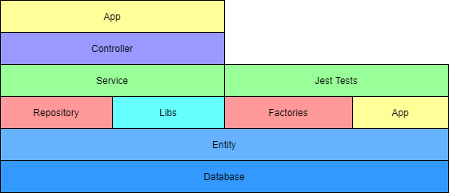

# App Architecture
The app architecture is based on Nestjs repository pattern.

## Concepts
- **App**: Application. [More information](https://docs.nestjs.com/cli/monorepo#monorepo-mode)
- **Library**: Code that can be shared between multiple apps. [More information](https://docs.nestjs.com/cli/libraries)
- **Module**: Code encapsulated. [More information](https://docs.nestjs.com/modules#modules)
- **Controller**: Layer responsible for handling incoming requests and returning responses to the client. [More information](https://docs.nestjs.com/controllers)
- **Service**: Layer with all bussiness logic. [More information](https://docs.nestjs.com/providers#services)
- **DTO**: (Data Transfer Object) Abstraction of the bodies sent to the API. [More information](https://docs.nestjs.com/techniques/validation#auto-validation)
- **Repository**: Layer that access to the database. [More information](https://docs.nestjs.com/techniques/database#repository-pattern)
- **Entity**: Class that maps to a database table [More information](https://github.com/typeorm/typeorm/blob/master/docs/entities.md)
- **Migration**: File that describes how the database change. [More information](https://github.com/typeorm/typeorm/blob/master/docs/migrations.md)
- **Factory**: Class that creates records of an entity in the database. [More information](https://github.com/w3tecch/typeorm-seeding#-using-entity-factory)

## Technologies
- Nestjs (Expressjs)
- Typeorm
- Typeorm-seeding
- Swagger
- Postgres
- Jest
- Husky
- Prettier
- Eslint
- Github Actions
- Docker/Docker-compose
- AWS (S3, RDS, ECS, Route53, Certificate Manager)