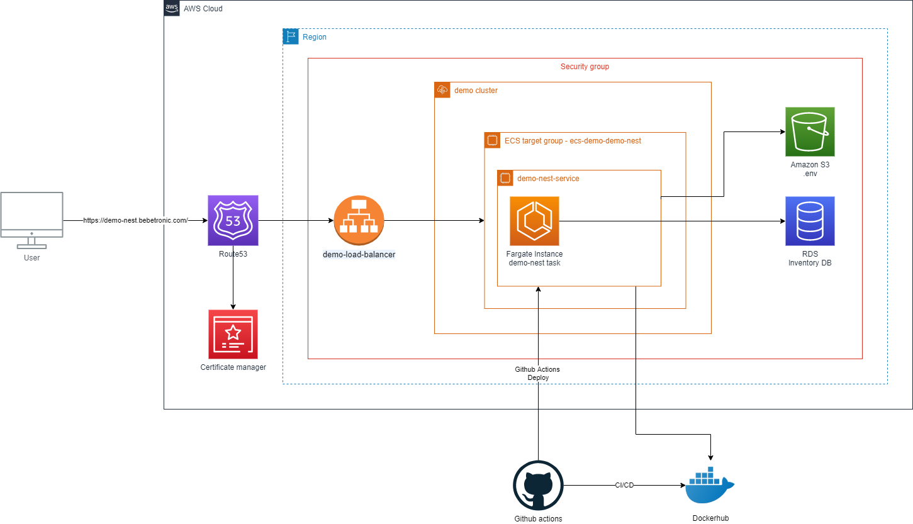
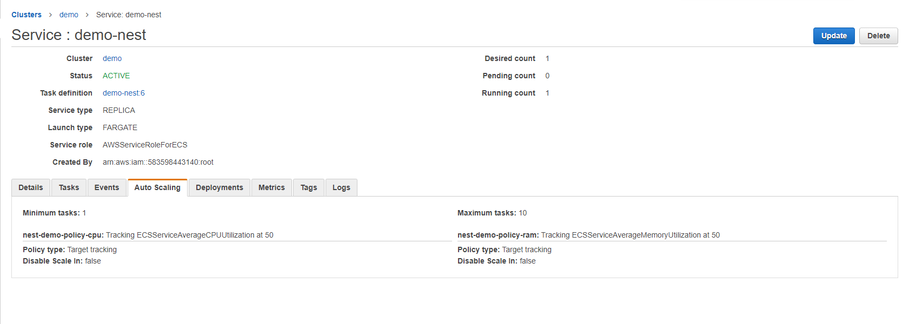

# Infrastructure architecture

This demo is deployed in AWS Cloud.

In ECS, I created a service with autoscaling policies to have an elastic infrastructure.

I created a subdomain of bebetronic.com (A domain that I own), then I created a SSL certificate using AWS Certificate manager so I can support https.

I created a load balancer to receive all incoming requests and balance them between the different ECS task instances.

The environment variables are in a S3 file.

The database is a RDS Postgres instance.

# CI/CD
I used github actions to build an image, publish it in docker hub and trigger the deployment in [ECS](https://aws.amazon.com/es/fargate/) when a developer merge his code to main.

I also configured github actions to execute all tests when a developer push his/her code to the repository.
